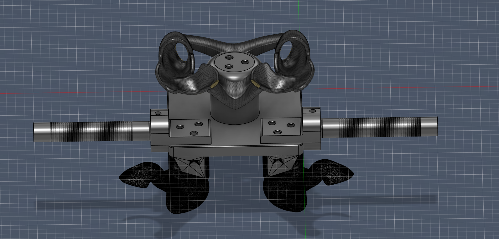
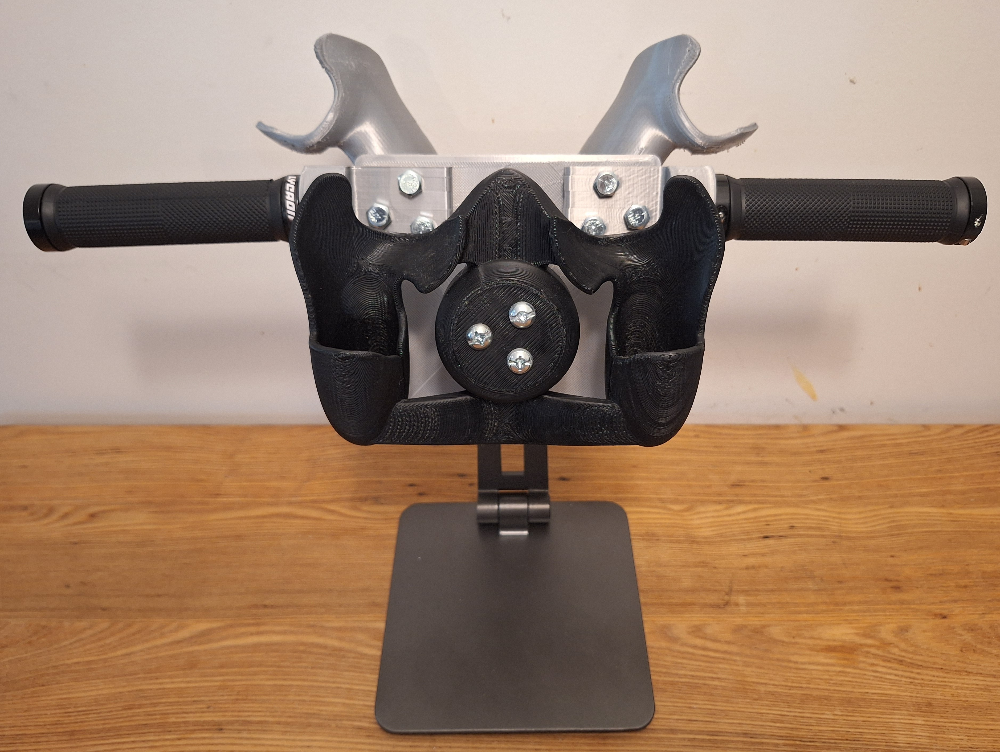
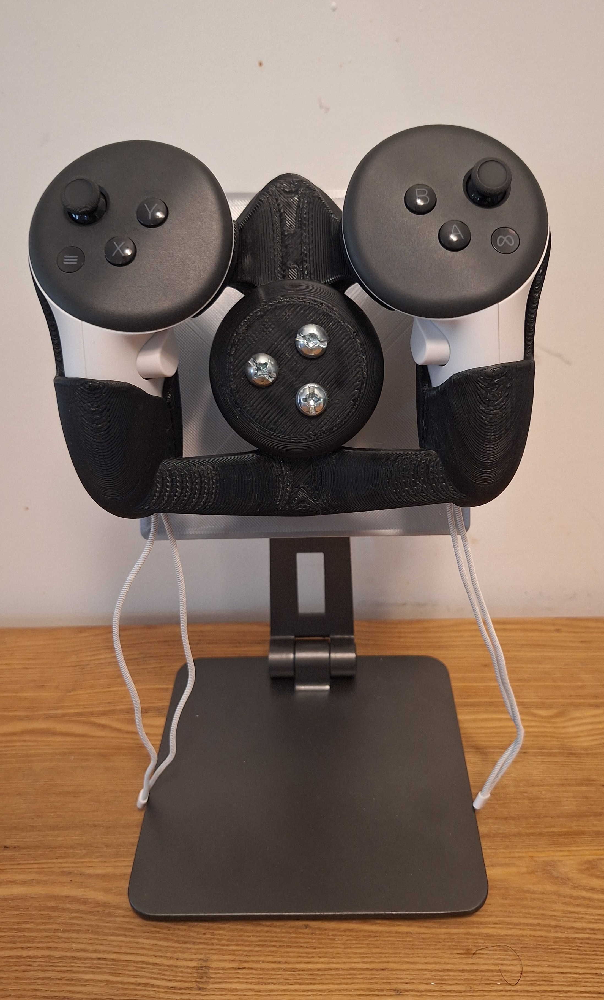
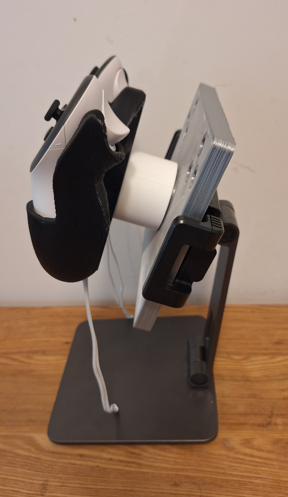
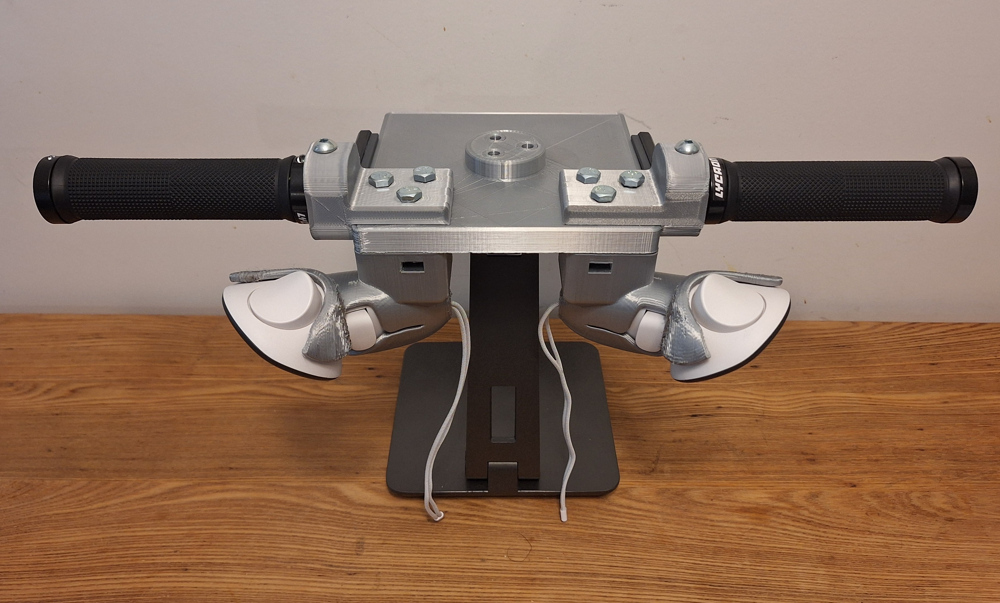

# Tangible Controller

This is a dual-purpose steering wheel and handlebars controller for VR (Meta Quest 3). The 3D printed controller fits on an ipad stand for simulating rotating a driving wheel and handlebars.

| Front                                                      | Side                                                     | Back                                                     |
| ---------------------------------------------------------- | -------------------------------------------------------- | -------------------------------------------------------- |
|  |  |  |

**Car mode**

| Front                                              | Side                                             |
| -------------------------------------------------- | ------------------------------------------------ |
|  |  |

**Bike mode**

| Front                                                | Back                                               |
| ---------------------------------------------------- | -------------------------------------------------- |
|  |  |

## Printing

- Print all pieces separately and oriented to avoid needing supports when possible:
    -  Handlebars: print vertically
    -  Wheel cradle: needs supports, print in normal orientation
    -  Handlebar bracket: print on its side and not vertically
    -  Baseplate: print in regular orientation
    -  Handlebar cradle: needs supports, print upside down

This was printed on a Bambu A1 and an Anycubic Vyper with settings optimized for speed and strength and PLA material.

For Bambu Studio:
- 0.8 mm nozzle (0.4 mm layer height)
- 20% sparse infill density
- Tree supports when needed

For AnyCubic (Use Ultimaker Cura slicer):
- Extra fast profile
- Adhesion type: skirt
- Line width: 0.48
- Wall thickness 2, wall line count 5
- Top/bottom thickness 2, top layers 4 and bottom layers 4
- Infill pattern gyroid
- Print speed 80, infill speed 100, travel speed 150
- Wall speed 50, inner wall speed 70, top/bottom speed 50
- Retraction speed: 45
- Support structure tree, placement buildplate only
- Support Z distance 0.3, XY distance 0.8, density 5%
- Support interface on, density 33%, pattern lines, roof height 0.6
- Support bottom interface off, bottom height 0.8
- Support tree top rate: 10

## Assembly

- Sand the pieces that need it
- Get 13 1/4 inch nuts and bolts
- (Optional): Get a pair of bike grips from amazon to put on the handlebars

## Sources

- [Quest 3 Controller Art](https://developers.meta.com/horizon/downloads/package/oculus-controller-art/)
- [Base Steering Wheel Model](https://vrcg-paul.booth.pm/items/6812922)

The cradle was scaled up 1.5% from the original.