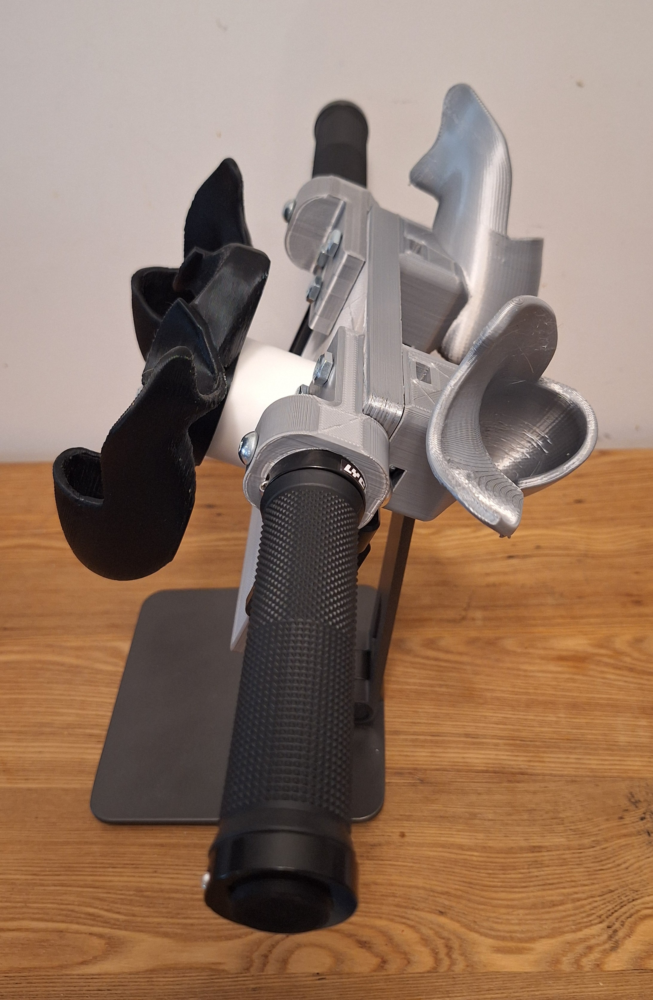
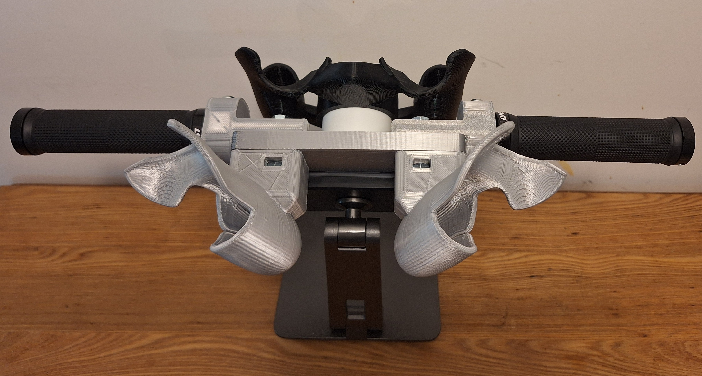
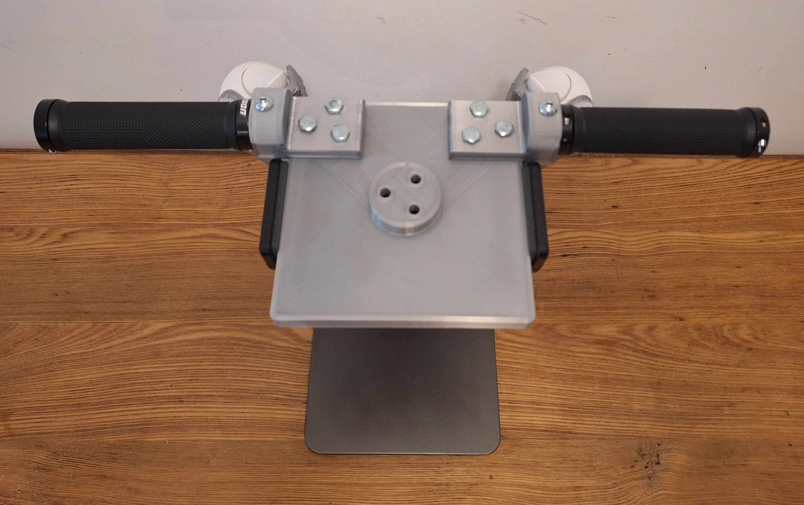

# Tangible Controller

3D-printed dual-purpose design that works as both a steering wheel and handlebars. Both Meta Quest 3 controllers fit inside and the assembly mounts on an iPad stand. Steering is read from the physical tilt of the controller.

The cradle was scaled up 1.5% so the controllers slide in without force.

| Front                                                      | Side                                                     | Back                                                     |
| ---------------------------------------------------------- | -------------------------------------------------------- | -------------------------------------------------------- |
|  |  |  |

**Car mode**

| Front                                              | Side                                             |
| -------------------------------------------------- | ------------------------------------------------ |
|  |  |

**Bike mode**

| Front                                                | Back                                               |
| ---------------------------------------------------- | -------------------------------------------------- |
|  |  |

## Build

Print `Steering Wheel.stl` and `Single Cradle.stl`. `Booleaned Steering Wheel.stl` is the union reference mesh used during modeling.

## Sources

- [Quest 3 Controller Art](https://developers.meta.com/horizon/downloads/package/oculus-controller-art/)
- [Base Steering Wheel Model](https://vrcg-paul.booth.pm/items/6812922)