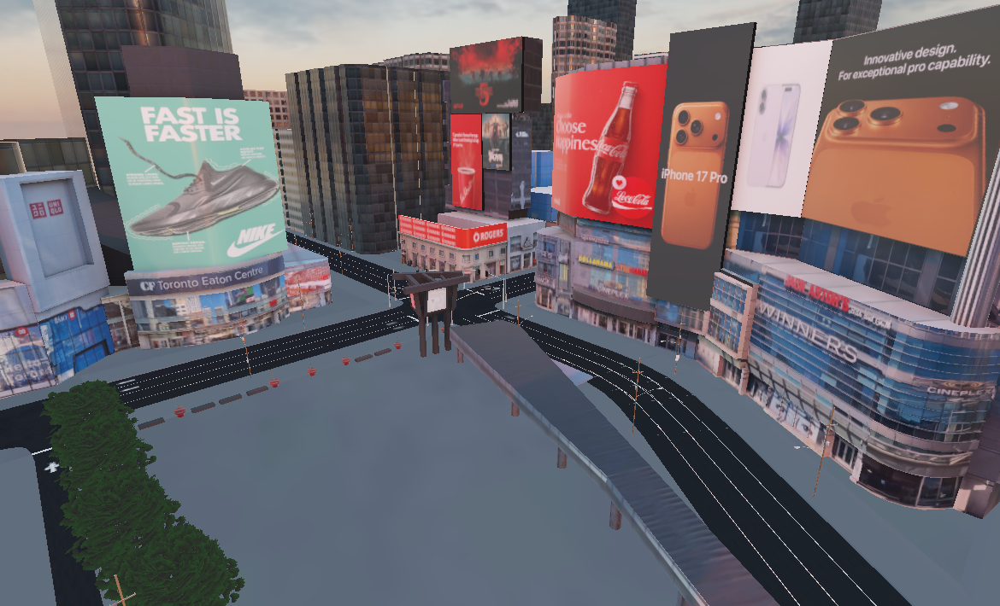
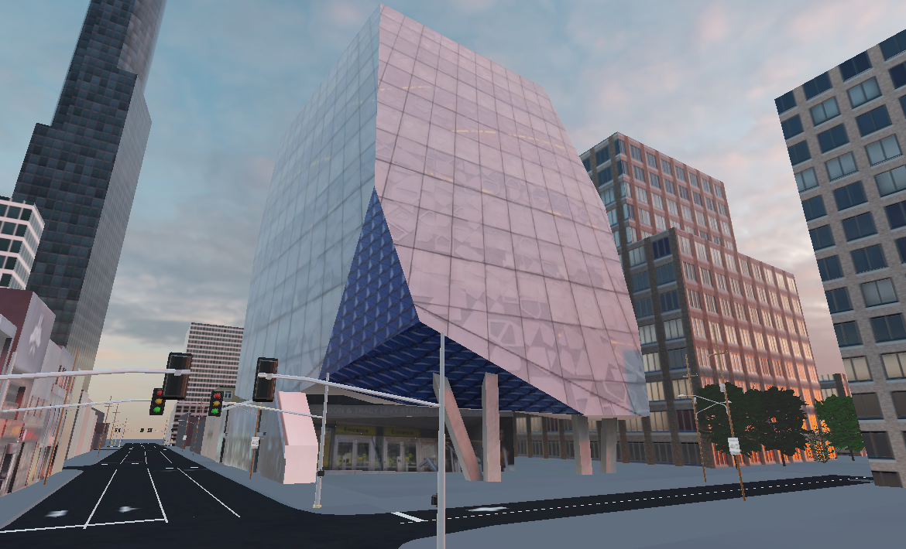
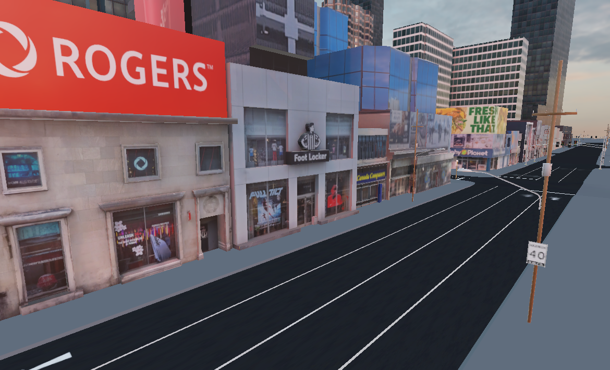

# Downtown Toronto 3D Model

Geo-accurate digital twin of the Yonge and Dundas intersection in Toronto. Modeled in Blender and used directly in the Unity simulation.

The exported FBX is located [here](../simulation/Assets/downtown/). The `.blend` source file is not included in this repository.

|                                                             |                                                                    |                                                           |
| ----------------------------------------------------------- | ------------------------------------------------------------------ | --------------------------------------------------------- |
|  |             |      |
|     |  |  |

## Modeling Pipeline

- Reference geometry: Blosm (OpenStreetMap import)
- Height calibration: Google 3D Tiles as reference
- Textures: own photography processed with Krita and Stable Diffusion AI inpainting
- UV mapping: projection mapping onto extruded OSM geometry
- Two blocks of Yonge and one block of Dundas done photorealistically; remaining buildings use PBR facade variants

- Use material combiner addon to make each block of buildings a 8k atlas

## FBX Export Settings (Blender)

- Path Mode: Copy, Embed Textures
- Limit to: Selected Objects
- Apply Scalings: FBX All

- Use FBX Bundler addon to copy textures and make mask maps

## Unity Import Settings

After importing the FBX:

- Model tab: enable **Generate Lightmap UVs**, Min Lightmap Resolution 4
- Materials tab: **Extract Materials**
- Add MeshCollider to all buildings
- Mark as **Static**
- Bake lightmap (Window > Rendering > Lighting > Generate Lighting)
- Bake occlusion culling (Window > Rendering > Occlusion Culling > Bake)

Material setup

- Setup the mask maps for all PBR textures, adjust Smoothness slider based on the material, 0.98 looks good for windows, 0.2 for others, 0.9 for billboards
- For all PBR textures (with normal maps), press "Fix Now" on the normal maps

Texture setup:

Select all downtown textures and apply:

- Stream Mipmap Levels: On
- Filter Mode: Trilinear
- Mipmap filtering: Kaiser
- Aniso Level: 4

Atlas textures (hero buildings):
- Max size 8192
- Wrap mode: Clamp
- Compression: High Quality

Mask maps:
- Uncheck sRGB

Normal maps:
- For the concrete normal map on hero buildings, set Normal Scale to ~0.3 in the material

