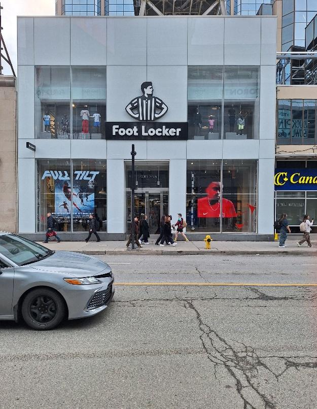
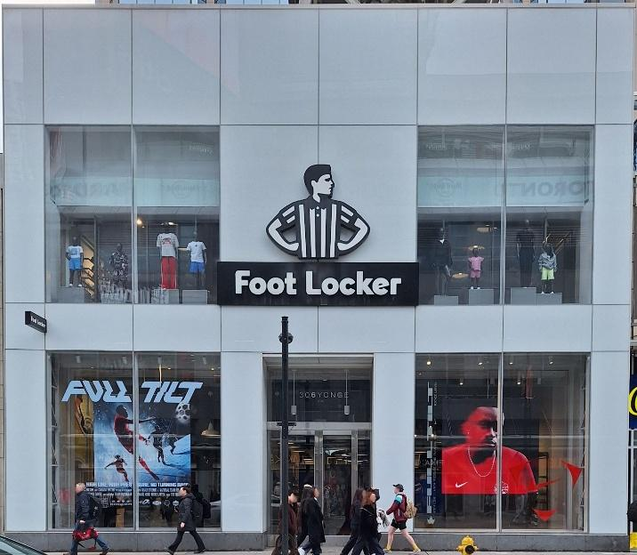
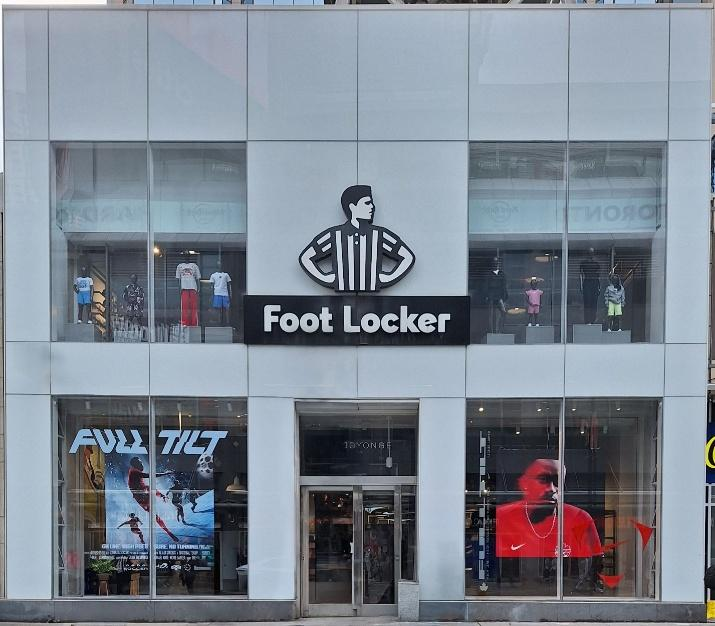
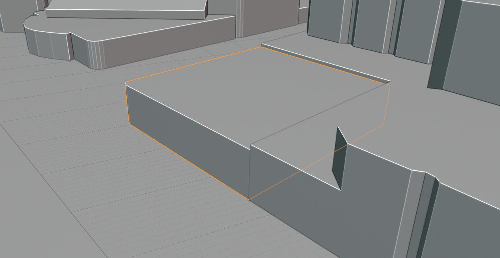
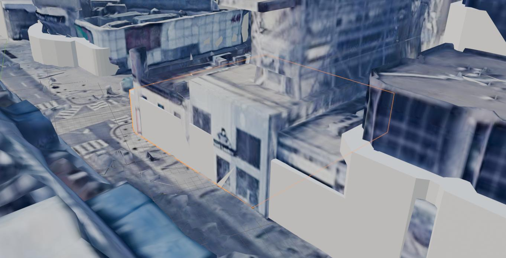
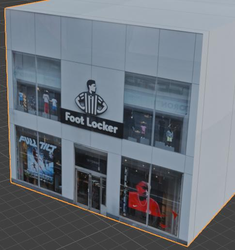
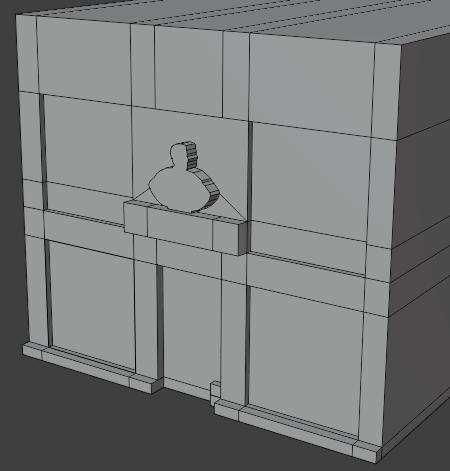
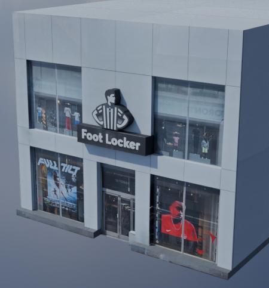
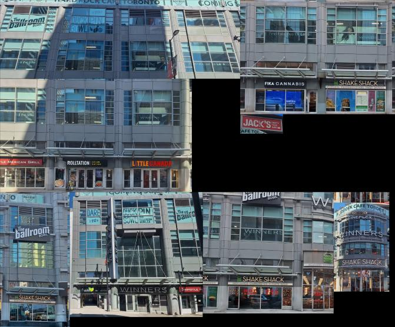

# Downtown Toronto 3D Model

Geographically accurate 3D model of the Yonge and Dundas intersection in downtown Toronto. It was modeled in Blender using real photos I took as the textures. The layout is done using OpenStreetMap data so it's accurate.

TODO
<!-- TODO: render of the whole downtown model -->

The modeled area is the bounding box between latitudes 43.6548N and 43.6600N and longitudes 79.3839W and 79.3777W. Two blocks of Yonge and one block of Dundas are photorealistic and built with the pipeline below. The remaining blocks use 7 simple PBR facade textures. Some billboard ads were also modeled to make it more realistic.

Full photogrammetry is expensive and hard to do in an area as busy as Yonge and Dundas, and hand modeling a building out of PBR textures takes a long time. This pipeline is a compromise which uses real photos to get realistic lighting and detail, and low poly geometry which is good in a game engine.

TODO
<!-- TODO: more renders -->

## Photos

All photos were taken in person with my phone camera. I was originally going to use Google Maps screenshots, but their license does not allow it. The photos are mostly building fronts, plus extra photos of the sides for buildings you can see around.

## Image processing

1. Crop the photo to maximize texture space
2. Rotate it to remove the slant from the original photo
3. Remove people, cars and trees with AI inpainting in Krita, using the [Krita AI Diffusion](https://github.com/Acly/krita-ai-diffusion) plugin

I used Stable Diffusion 1.5 (Serenity) and SDXL (RealVisXL) for inpainting. This works well in most cases but has trouble when the thing being removed sits in front of text or a logo, which the models reconstruct badly.

| Original                                                    | Cropped                                                            | Inpainted                                                          |
| ------------------------------------------------------------- | -------------------------------------------------------------------- | -------------------------------------------------------------------- |
|  |     |  |

## Buildings from OSM

The [Blosm](https://github.com/vvoovv/blosm) add-on generates simple extrusions of every building in the bounding box from public OSM data, so nothing has to be blocked out or aligned by hand.

Some of the OSM data is old or wrong, mostly building heights. To fix that I imported Google 3D tiles, which is aerial photogrammetry of the city, and compared the extrusions against it directly in Blender.

| Blosm extrusions                                                     | Google 3D tiles reference                                             |
| ---------------------------------------------------------------------- | ------------------------------------------------------------------------ |
|  |  |

## Texturing and detail

Once the extrusions are scaled correctly:

1. UV unwrap with a cube projection, or a view projection when the photo was taken from an angle
2. Apply the building texture to each side, with the sides using a subsection of the front image
3. Loop cut along the details in the image, then extrude the major ones: windows, curbs, signs
4. Lower the roughness on the windows so they reflect, and add a low intensity concrete normal map everywhere else

Extruding this way is fast but leaves artifacts like overlapping faces and bad topology, so each building needs a cleanup pass. Some UVs also had to be edited by hand to fix distortion and re-map areas.

| Projected on a cube                                            | Extruded detail                                                       | Final building                                                   |
| ---------------------------------------------------------------- | ------------------------------------------------------------------------ | ------------------------------------------------------------------ |
|  |  |  |

## Texture atlases

Building images are packed into atlases to reduce draw calls. The atlas below is the Tenor on Yonge Street and textures a whole street block.

## In Unity

|                                                             |                                                                    |                                                           |
| ----------------------------------------------------------- | ------------------------------------------------------------------ | --------------------------------------------------------- |
|  |             |      |
|     |  |  |

## Unity Import Settings

After importing the FBX:

- Model tab: enable **Generate Lightmap UVs**, Min Lightmap Resolution 4
- Materials tab: **Extract Materials**
- Add MeshCollider to all buildings
- Mark as **Static**
- Bake lightmap (Window > Rendering > Lighting > Generate Lighting)
- Bake occlusion culling (Window > Rendering > Occlusion Culling > Bake)

Material setup

- Setup the mask maps for all PBR textures, adjust Smoothness slider based on the material, 0.98 looks good for windows, 0.2 for others, 0.9 for billboards
- For all PBR textures (with normal maps), press "Fix Now" on the normal maps

Texture setup:

Select all downtown textures and apply:

- Stream Mipmap Levels: On
- Filter Mode: Trilinear
- Mipmap filtering: Kaiser
- Aniso Level: 4

Atlas textures (hero buildings):
- Max size 8192
- Wrap mode: Clamp
- Compression: High Quality

Mask maps:
- Uncheck sRGB
