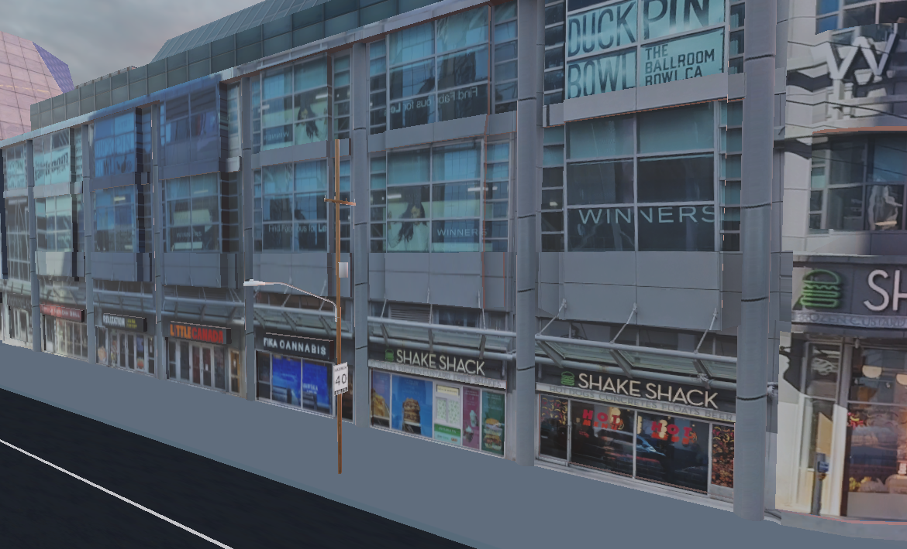
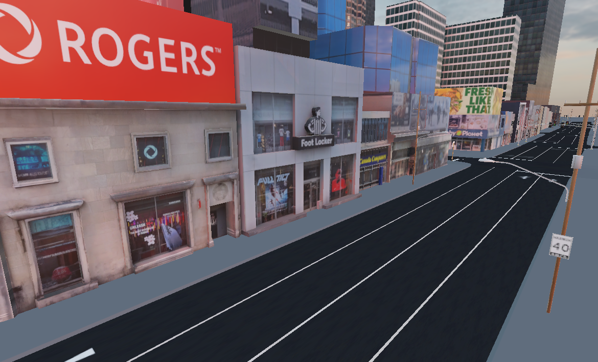
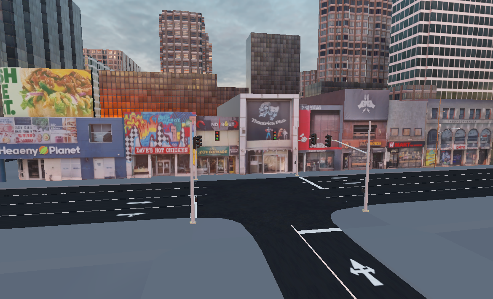
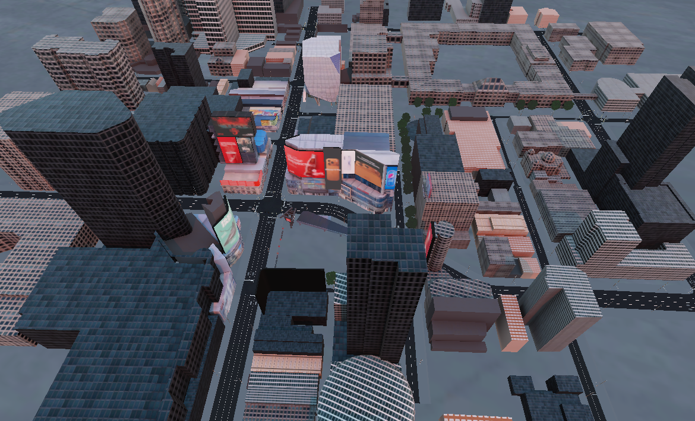

# Downtown Toronto 3D Model

Geographically acurate 3D model of the Yonge and Dundas intersection in downtown Toronto. It was modeled in Blender using real photos I took as the textures. The layout is done using OpenStreetMap data so it's accurate.

|                                                             |                                                                    |                                                           |
| ----------------------------------------------------------- | ------------------------------------------------------------------ | --------------------------------------------------------- |
|  |             |      |
|     |  |  |

## Unity Import Settings

After importing the FBX:

- Model tab: enable **Generate Lightmap UVs**, Min Lightmap Resolution 4
- Materials tab: **Extract Materials**
- Add MeshCollider to all buildings
- Mark as **Static**
- Bake lightmap (Window > Rendering > Lighting > Generate Lighting)
- Bake occlusion culling (Window > Rendering > Occlusion Culling > Bake)

Material setup

- Setup the mask maps for all PBR textures, adjust Smoothness slider based on the material, 0.98 looks good for windows, 0.2 for others, 0.9 for billboards
- For all PBR textures (with normal maps), press "Fix Now" on the normal maps

Texture setup:

Select all downtown textures and apply:

- Stream Mipmap Levels: On
- Filter Mode: Trilinear
- Mipmap filtering: Kaiser
- Aniso Level: 4

Atlas textures (hero buildings):
- Max size 8192
- Wrap mode: Clamp
- Compression: High Quality

Mask maps:
- Uncheck sRGB
